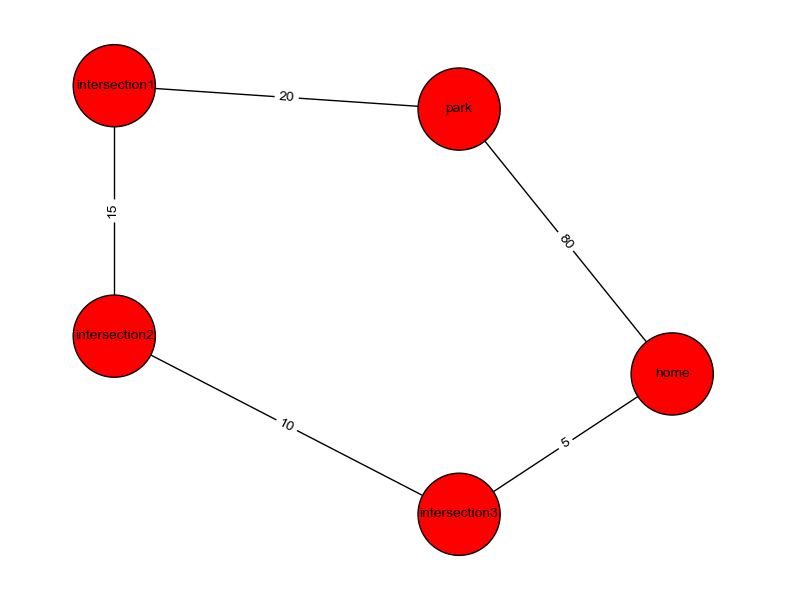

MSI - Pyhop travelling example
==============================

Pyhop travelling example with more features.

## Objective

You are able to pay at most $m to get from park to home in at most t minutes.

You need to get a proper plan for doing this.

You are starting at hh:00 (for any hh in {00, 01, ..., 23}).

## City

I used the following map:



### Distances

Distances are measured in km.

### Means of transportation

#### Taxi

You are able to board a taxi in any place.

The price for the taxi is $(20 + 1.5 * distance).
 
The taxi goes at 20 km/h.

#### Buses

There are buses leaving every 10 minutes (6 per hour), starting from hh:00 (for hh in {00, 01, ..., 23}).
You are able to board/unboard buses at following points:

* Park
* Intersection 1
* Intersection 2
* Intersection 3

The bus goes at 15 km/h.

The price for the bus is $(1 + 0.1 * distance).

You need to wait for bus if it goes away.

#### Walking (on foot)

You are also able to walk on foot.

Walking on foot is at 5 km/h.

## Operators and methods

I defined the following operators and methods:

### Going on foot

#### Operators

There is one defined operator for walking:

```python
def walk(state, who, from_place, to_place)
```

It defines changing place from `from_place` to `to_place`.

It also measures how much time does the walking require.

#### Methods

There is one defined method for walking:

```python
def travel_on_foot(_, a, from_place, to_place)
```

It performs walking from `from_place` to `to_place`.

### Travelling by taxi

#### Operators

There are 3 operators for travelling by taxi:

* Calling the cab

```python
def call_taxi(state, a, from_place)
```

It performs calling the taxi (which takes 10 minutes).

* Riding a taxi

```python
def ride_taxi(state, a, from_place, to_place)
```

It performs changing location from `from_place` to `to_place`.

It also measures the time that passes during the ride.

* Paying the driver

```python
def pay_driver(state, a)
```

It performs paying the taxi fare to driver.

#### Methods

There is one defined method for travelling by taxi:

```python
def travel_by_taxi(state, a, from_place, to_place)
```

It performs travelling by taxi from `from_place` to `to_place`.

### Travelling by bus

#### Operators

There are 3 operators for travelling by bus:

* Getting into bus

```python
def get_into_bus(state, a, from_place, to_place)
```

It performs getting into bus (which time varies due to the bus schedule and current time).

* Riding a bus

```python
def ride_bus(state, a, from_place, to_place)
```

It performs changing location from `from_place` to `to_place`.

It also measures the time that passes during the ride.

* Paying for the ticket

```python
def pay_for_bus(state, a)
```

It performs paying the bus fare.

#### Methods

There is one defined method for travelling by bus:

```python
def travel_by_bus(state, a, from_place, to_place)
```

It performs travelling by bus from `from_place` to `to_place`.

## Example plans

### Indirect path (via intersections) - $8, 180 min

We assume that we're travelling from park to home and we have
$8 money and 180 min to get into destination.

The derived plan:

```python
result = [('get_into_bus', 'me', 'park', 'intersection1'),
          ('ride_bus', 'me', 'park', 'intersection1'),
          ('pay_for_bus', 'me'),
          ('get_into_bus', 'me', 'intersection1', 'intersection2'),
          ('ride_bus', 'me', 'intersection1', 'intersection2'),
          ('pay_for_bus', 'me'),
          ('get_into_bus', 'me', 'intersection2', 'intersection3'),
          ('ride_bus', 'me', 'intersection2', 'intersection3'),
          ('pay_for_bus', 'me'),
          ('walk', 'me', 'intersection3', 'home')] 
```

### Indirect path (via intersections) - $80, 100 min

We assume that we're travelling from park to home and we have
$80 money and 100 min to get into destination.

The derived plan:

```python
result = [('get_into_bus', 'me', 'park', 'intersection1'),
          ('ride_bus', 'me', 'park', 'intersection1'),
          ('pay_for_bus', 'me'),
          ('call_taxi', 'me', 'intersection1'),
          ('ride_taxi', 'me', 'intersection1', 'intersection2'),
          ('pay_driver', 'me'),
          ('get_into_bus', 'me', 'intersection2', 'intersection3'),
          ('ride_bus', 'me', 'intersection2', 'intersection3'),
          ('pay_for_bus', 'me'),
          ('call_taxi', 'me', 'intersection3'),
          ('ride_taxi', 'me', 'intersection3', 'home'),
          ('pay_driver', 'me')] 
```

### Direct path - $140, 250 min

We assume that we're travelling from park to home and we have
$140 money and 250 min to get into destination.

The derived plan:

```python
result = [('call_taxi', 'me', 'park'),
          ('ride_taxi', 'me', 'park', 'home'),
          ('pay_driver', 'me')] 
```

### Direct path - $50, 100 min

We assume that we're travelling from park to home and we have
$50 money and 100 min to get into destination.

The derived plan:

```python
False
```

(There is no possible plan for this configuration).